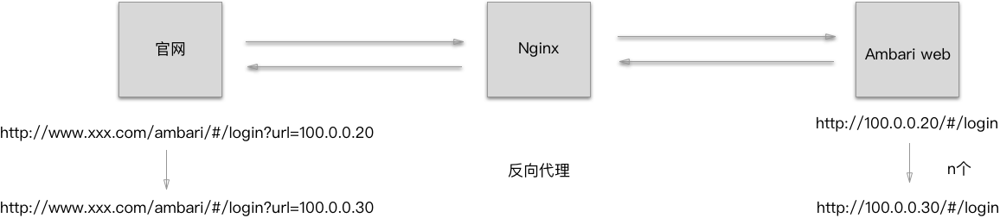

&emsp;&emsp;最新公司有个很有意思的需求,官网iframe访问内网部署的一个第三方开源系统 Ambari，并且每个实例对应一个
Ambari Web服务。所以考虑到了用 Ngixn 来做动态反向代理。

<br>
<br>



###### 方案  
1.根据访问实例调用接口获取该实例内网的IP和Port，并动态拼接到请求链接后<br>
2.Nginx通过ui请求链接后边的url参数进行动态代理<br>


###### Nginx 动态代理
````
// $args 所有请求参数
// $arg_url 获取请求中的的参数名的值（url为参数名）
// $request_uri 请求参数的原始URI，不包含主机名
// $uri 当前的请求URI，不包括任何参数(见$args)
 
 
location /ambria/ {     
  set $ambria_args $args;
  set $ambria_uri $uri;
  # 去除 ambria
  if ($uri ~ "^/ambria(.*)$") {
      set
  $ambria_uri $1;
  }
  # 去除url参数
  if ($args ~ "^(.*)(&url=.*)(&.*)$") {
      set
  $ambria_args $1$3;
  }
  if ($args ~ "^(url=.*&)(.*)$") {
      set
  $ambria_args $2;
  }
  if ($args ~ "^(url=.*)$") {
      set
  $ambria_args '';
  }
  # 解决禁止iframe内嵌
  proxy_hide_header
  X-Frame-Options;
  add_header X-Frame-Options
  ALLOW-FROM;
  # socket
  proxy_http_version 1.1;
  proxy_set_header Upgrade
  $http_upgrade;
  proxy_set_header
  Connection "upgrade";
  # 代理
  proxy_pass 
  http://$arg_url$ambria_uri?$ambria_args;
  error_page 404 /404;
}

```

###### Nginx 解决字体跨域

```
location /app/ {
    
  if ($request_uri ~* \.(eot|ttf|woff|woff2|svg|otf) ) { #字体跨域解决
         add_header Access-Control-Allow-Origin *;
  }
}
```


