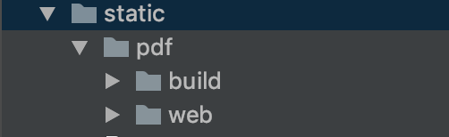

vue项目中通过axios返回pdf文件流，并展示预览

###### 通过axios获取文件流

1.responseType: 'blob' 设置成blob
```javascript
export function preview(contCode) {
	
  return request({
    url: `/pdf/preview/${contCode}`,
    method: 'get',
    responseType: 'blob'
  })
}
```
2.将文件流转成url对象
```javascript
      preview(contCode) {
	
        preview(contCode).then(result => {
          this.pdfUrl = this.getObjectURL(result);
          this.previewVisible = true;
        })
      },
      // 将返回的流数据转换为url
      getObjectURL(file) {
        let url = null;
        if (window.createObjectURL != undefined) { // basic
          url = window.createObjectURL(file);
        } else if (window.webkitURL != undefined) { // webkit or chrome
          try {
            url = window.webkitURL.createObjectURL(file);
          } catch (error) {

          }
        } else if (window.URL != undefined) { // mozilla(firefox)
          try {
            url = window.URL.createObjectURL(file);
          } catch (error) {

          }
        }
        return url;
      }
```

3.iframe中src引用pdfUrl
```html
    <el-dialog title="合同预览" :visible.sync="previewVisible" width="80%" top="40px">
    
      <iframe class="prism-player" :src="pdfUrl" width="100%" height="600px"></iframe>
    </el-dialog>
```


###### axios获取文件流并下载文件
文件预览讲完了，我们来看一下文件下载，区别在🐟new Blob()获取文件流生成一个新的blob对象，并创建blob对象链接
,通过a标签href进行下载。
download也可以不写任何信息，会自动使用默认文件名。
```javascript
      preview(contCode) {
        preview(contCode).then(result => {
          this.previewVisible = true;
          let url = window.URL.createObjectURL(new Blob([result]));
          let link = document.createElement("a");
          link.style.display = "none";
          link.href = url;
          link.target="_blank"
          let timestamp=new Date().getTime();
          link.download = timestamp + ".pdf";
          document.body.appendChild(link);
          link.click();
        })
       }
```

参考文章: https://www.cnblogs.com/usebtf/p/10329977.html


<!--
###### 通过PDF.js
1.将 [PDF.js](https://github.com/mozilla/pdf.js) 中build和web文件夹copy到我们项目中static文件
夹中，当然也可以直接下载处理好的(去除无用代码，不然打包体积会很大) [pdf文件](../vue项目中预览pdf文件流/pdf.zip)



2.直接调用文件流的请求地址
直接调用文件流的请求地址
```javascript
// 这儿的url， 就是通过 axios 进行请求的地址，只不过换成了从导航url进行请求的方式
  
let url = process.env.BASE_API + '/coursePartDetail/getFileStreamByCoursePartDetailId?CoursePartDetailId=' + this.sectionMsg.id
this.pdfUrl = `/static/pdf/web/viewer.html?file=${encodeURIComponen
```
3.iframe中src设置成刚才处理好的pdfUrl
```html
    <el-dialog title="合同预览" :visible.sync="previewVisible" width="80%" top="40px">
    
      <iframe class="prism-player" :src="pdfUrl" width="100%" height="600px"></iframe>
    </el-dialog>
```
-->

